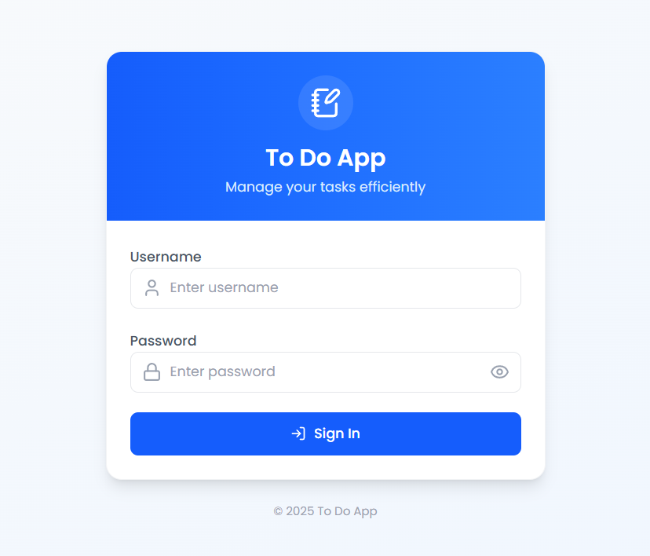
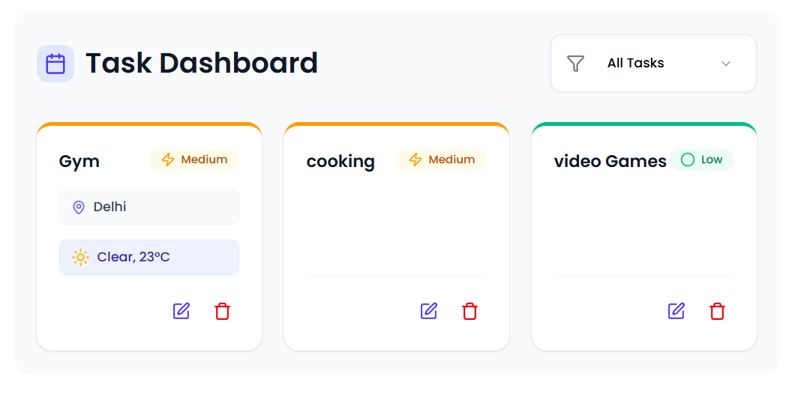

# 📝 ToDo Application
**A feature-rich task management app with authentication**  
   

## ✨ Features

- Add, edit, delete tasks
- Mark tasks as complete
- Filter tasks by status
- Responsive design
- Persistent data with JSON Server
- Authentication (if applicable)

## 🚀 Tech Stack

**Frontend:**
- ⚡ Vite (Build tool)
- ⚛️ React 18
- 🎨 Tailwind CSS (or your CSS solution)
- 🔄 Redux Toolkit (if using state management)
- 📡 Axios/Fetch for API calls

**Backend:**
- 🛢️ JSON Server (Mock REST API)

## 🚀 Live Demo
[Render](https://todo-app-f3za.onrender.com/)

## 📸 Screenshots
| Login Screen | Dashboard |
|--------------|-----------|
|  |  |

## 🛠️ Setup & Installation

### Prerequisites
- Node.js ≥16.0.0
- npm/yarn

### 1. Clone the repository (Frontend)

git clone https://github.com/your-username/todo-app.git

🔧 Environment Variables

Frontend (create .env file in frontend folder):
    VITE_API_BASE_URL=http://localhost:3001 # For development
    VITE_API_BASE_URL=https://your-deployed-backend.com # For production

cd todo-app
npm run dev

### 2. Clone the repository (Backend)
git clone https://github.com/shivamsharma3027/ToDo-App-Backend.git
npm start(in separate terminal)

📝 API Endpoints
 
Method	    Endpoint	        Description
GET	     /tasks	        Get all tasks
POST	     /tasks	        Create new task
PUT	     /tasks/:id	        Update task
DELETE	     /tasks/:id	        Delete task

🌐 Deployment

Frontend deployed on(Render): https://todo-app-f3za.onrender.com

Backend deployed on(Render): https://todo-app-backend-1-fme2.onrender.com/

